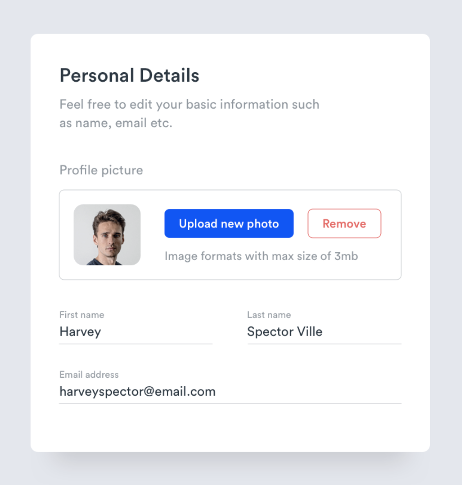

## What are we asking you to do

Replicate this UI:

When the **remove** button is clicked, the user thumbnail should disappear.
This feature is to be done with javascript.

Inside `src/index.php` you will find a base html template, with a `User` object already loaded.

You are free to use any css and js frameworks you want.

### Bonus 1
Make the UI responsive, handling both tablet and smartphone.

## Color palette:
- main background: #e3e7ed;
- card background: #ffffff;
- borders color: #dadde0;
- blue: #004efc;
- red: #f46666;
- text dark: #2b3a44;
- text light: #989fa7;

## Font
Please use [Roboto](https://fonts.google.com/specimen/Roboto) as font for the whole UI.

## What to do when you are done
Send us a zip with your project

### Bonus 2
Instead of sending us a Zip, create a separate branch of this repository and push there your work.